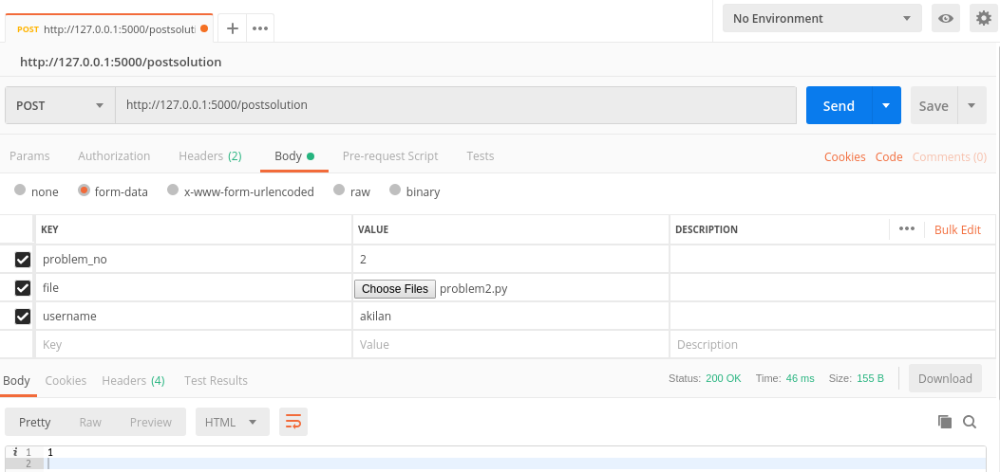

# Programming points code test

## 1. To start the flask server
Refer this link:
https://flask.palletsprojects.com/en/1.1.x/quickstart/

## 2. To configure the application refer to the comments inside the code(app.py)

## 3. Post request format
   Recommended to use POSTMAN just for testing purposes
   
### Element names
    1. problem_no
    2. username
    3. file
